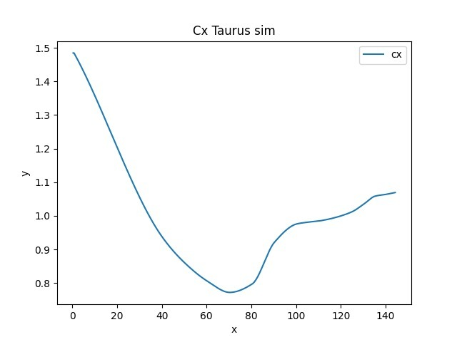

# Policumbent WHPSC Simulator

Website of WHPSC Simulator [here](https://www.policumbent.it/whpsc-sim/).

## Technical explanation

### Simulation

The code solves an energy balance equation by considering an interval initial time t0 and end time t1, the equation is given by $\Delta Ec = \eta P \Delta t + \Delta Ep - E_diss$
where on the right-hamd side:

- $\Delta Ec = Ec(t_1) - Ec(t_0)$ is the kinetic’s energy difference.
- $\eta P \Delta t$ the rider’s energy input.
- $\Delta Ep$ potential energy difference generated by the road’s slope.
- $Ediss$ accounts for the dissipated energy by rolling resistance and air drag.

### Coefficients

Coefficients for rolling resistance (Cr) and drag resistance (Cd) are needed for the energy balance equation.
For the road bike Cr’s initial value at 0.1 m/s is taken as Cr = 0.005 (relatively smooth asphalt, mid-market 28’ tyres) and Cd = 0.68 at 15 m/s (see ‚CFD ‚analysis of an exceptional cyclist sprinter position‘, Blocken et al.).
Cd’s value for the unfaired recumbent bike is taken basing on CdA = 0.18 at at 50 km/h (see The Recumbent Bicycle and Human Powered Vehicle Information Center) and Area = 0.2. Cr stays unchanged with respect to the road bike. Come abbiamo fatto variare il Cd?
Coefficients for Taurus are set with values similar to its estimated ones. In particular the drag coefficient’s curve shape is reproduced with a different reference value at v=120 km/h.

| Vehicle | Cd@120 km/h | Cr | Frontal Area (m²) |
| ------ | ------ | ------ | ------ |
|Road bike | $1.036*Cd$(v=120km/h) at 0.1 m/s; $0.9208*Cd(v=120km/h)$ at 40 m/s | 0.005 at 0,1 m/s; 0.0062 at 40 m/s    | 100 < h <= 165 => 0.34; 165 < h <= 175 => 0.38; 175 < h <= 185 => 0.43; 185 < h <= 200 => 0.48|
Unfaired recumbent bike |    same as above | same as above |  100 < h <= 165 => 0.26; 165 < h <= 175 => 0.29; 175 < h <= 185 => 0.32; 185 < h <= 200 => 0.36 |
Taurus | $1.4843*Cd(v=120km/h)$ at 0.1 m/s; $1.0691*Cd(v=120km/h)$ at 40 m/s | 0.0029 at 0.1 m/s;  0.0045 at 40 m/s |0.04 | a |

*Shape of cx curve of Taurus*

## How to use it

### Windows/MacOs/Chrome OS/Android

1. Go to [policumbent.it/whpsc-sim](https://www.policumbent.it/whpsc-sim/)
2. Connect your bluetooth powermeter. (This functionality is available only in Google Chrome 83+)
3. Start a new run

### Linux

1. How you can see [here](https://github.com/WebBluetoothCG/web-bluetooth/blob/gh-pages/implementation-status.md), Linux version of bluettoth API are partially implemented and not supported. So you need to enable `chrome://flags/#enable-experimental-web-platform-features`.
1. Go to [policumbent.it/whpsc-sim](https://www.policumbent.it/whpsc-sim/)
1. Connect your bluetooth powermeter. (This functionality is available only in Google Chrome 83+ and on linux may not work)
1. Start a new run

## Requirements

- **Android**: Requires Android 6.0 Marshmallow or later.
- **Mac**: Requires OS X Yosemite or later. (Some MacBooks may not work: Check "About this Mac" / "System Report" / "Bluetooth" and verify that Low Energy is supported.)
- **Linux**: Requires Kernel 3.19+ and BlueZ 5.41+ installed. Read How to get Chrome Web Bluetooth working on Linux.(Note that Bluetooth daemon needs to run with experimental interfaces if BlueZ version is lower than 5.43: sudo /usr/sbin/bluetoothd -E)
- **Windows**: Requires Windows 10 version 1706 (Creators Update) or later.

## License

[AGPL](https://github.com/policumbent/WHPSC-Sim/blob/master/LICENSE)
